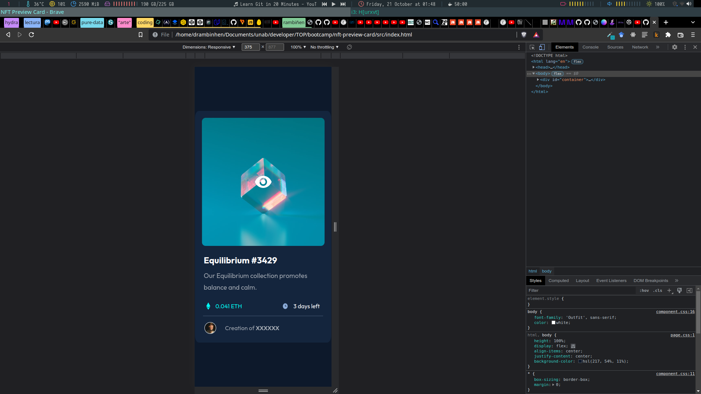
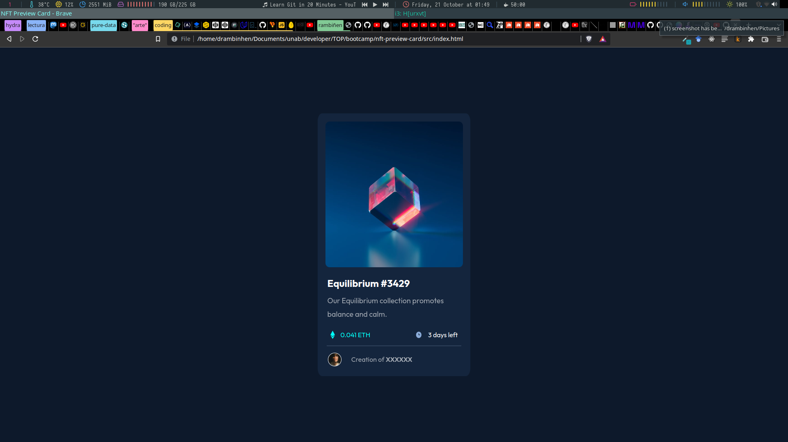
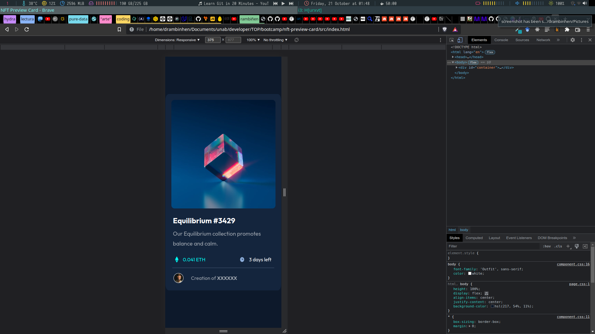

# Make It Real - NFT PREVIEW CARD

This is a solution to the _______NFT Preview Card project of the Make It Real course.

## Table of contents

- [Overview](#overview)
  - [The challenge](#the-challenge)
  - [Screenshot](#screenshot)
- [My process](#my-process)
  - [Built with](#built-with)
  - [What I learned](#what-i-learned)
  - [Continued development](#continued-development)
  - [Useful resources](#useful-resources)
- [Author](#author)
- [Acknowledgments](#acknowledgments)

## Overview

### The challenge

Users should be able to:

- Develop mobile design & hover effect
- Develop desktop design & hover effect

### Screenshot

## My process

### Built with

- Semantic HTML5 markup
- CSS custom properties
- Flexbox
- Mobile-first workflow

### What I learned

Better understanding of background in general

### Useful resources

- [Example resource 1](https://www.youtube.com/watch?v=3T_Jy1CqH9k) - This helped me to understand in a better way background in css.
- [Example resource 2](https://frontendresource.com/css-background-image-color/) - This helped me to get some tips about brackground image mix with color.

## Author

daniel monsalve

## Acknowledgments

Yulany and Salomon
